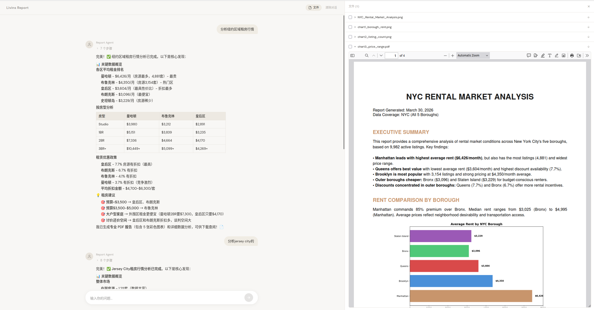

# Livins Report Agent — FC 面试题目一 Demo

这是针对 **FC 面试题目一** 做的 Demo 演示。当前使用 Livins 的房源数据库做演示数据源，但实现的功能与题目要求一致——自然语言查询、数据分析、图表生成、PDF 报告输出，切换为其他数据源只需替换 Schema 和数据库连接。



## 功能

- 自然语言提问，Agent 自动查询房源数据库（Text-to-SQL）
- 根据查询结果自动生成数据图表（matplotlib）
- 自动生成 PDF 报告，支持在线预览和下载
- SSE 流式推送，实时显示 Agent 工具调用步骤（SQL、代码执行等）
- 多轮对话，支持上下文追问

## 关于图表/PDF 生成

当前 Demo 使用 **LLM Code Execution 沙盒**（Anthropic 托管容器）生成图表和 PDF：Agent 在沙盒中执行 matplotlib 绘图 + reportlab 组装 PDF，通过 Files API 取回文件。这种方式零运维、开发快，但沙盒启动+执行约 5-15 秒，且有额外的 API 费用。

**生产环境升级方案**（速度提升 10x+，成本大幅降低）：

| 组件 | Demo（当前） | Production（计划） |
|------|-------------|-------------------|
| 图表 | LLM 沙盒 + matplotlib（5-15s） | [antvis/mcp-server-chart](https://github.com/antvis/mcp-server-chart) MCP Server，26+ 图表类型，~1-2s，免费 |
| PDF | LLM 沙盒 + reportlab（同上） | Jinja2 模板 → HTML → Playwright，warm 模式 13ms，无沙盒费用 |

升级后无需远程沙盒，可切换任意 LLM，详见 `docs/architecture/decisions.md` 第 5 条。

## 已知限制

- **未做手机端适配**，仅适合桌面浏览器使用
- **对话历史仅存浏览器 localStorage**，未入库持久化。清除对话或清除浏览器数据后**无法找回**
- Demo 级别项目，未做生产级错误处理和鉴权

## 技术栈

| 层 | 技术 |
|---|------|
| 前端 | Next.js 15 + React 19 + Tailwind CSS v4 + @react-pdf-viewer/core |
| 后端 | FastAPI + LangGraph ReAct Agent + LangChain |
| LLM | Anthropic / OpenAI（可切换）|
| 图表/PDF | Demo: LLM Code Execution 沙盒（matplotlib + reportlab）→ Prod: antvis MCP + Playwright |
| 数据库 | PostgreSQL + PostGIS（通过 Livins Data Service API）|

## 在线体验

已部署到 GCP Cloud Run，直接访问：

**https://livins-report-ootdxiumvq-ue.a.run.app**

打开后在聊天框输入自然语言问题即可，例如：
- "帮我分析各区域房源价格分布"
- "曼哈顿一居室过去3个月的租金趋势"
- "对比布鲁克林和曼哈顿的房源数量"

Agent 会自动查询数据库、生成图表和 PDF 报告，右侧面板可预览和下载 PDF。

## 本地开发

```bash
# 安装依赖
pip install -e ".[dev]"
cd frontend && pnpm install && cd ..

# 配置环境变量
cp .env.example .env          # 编辑填入 ANTHROPIC_API_KEY
cp frontend/.env.local.example frontend/.env.local

# 一键启动前后端
./dev.sh
# → Frontend: http://localhost:3000
# → Backend:  http://localhost:8000
```

## 项目结构

```
├── src/livins_report_agent/    # 后端
│   ├── agent/                  # ReAct Agent
│   ├── api/                    # FastAPI 端点（/chat, /chat/stream, /reports）
│   ├── tools/                  # 工具（query_database, load_skill, code_execution）
│   ├── skills/                 # Skill 文件（Schema、图表规范、报告规范）
│   └── apartment_client/       # 数据服务客户端
├── frontend/                   # Next.js 前端
│   └── src/
│       ├── components/         # Chat、PDF 预览组件
│       ├── hooks/              # useChat, usePdf, useLocalStorage
│       └── lib/                # API 调用、类型定义
├── tests/                      # 单元测试 + E2E 测试
├── docs/                       # 架构文档（所有设计细节）
└── dev.sh                      # 一键启动前后端
```

## 设计文档

`docs/` 目录包含所有架构设计细节：

- **[docs/architecture/overview.md](docs/architecture/overview.md)** — 系统全景、设计哲学、技术栈、依赖分层
- **[docs/architecture/agent.md](docs/architecture/agent.md)** — Agent、Tools、Skills、Client 设计与数据流
- **[docs/architecture/api.md](docs/architecture/api.md)** — API 端点、请求/响应格式、错误码
- **[docs/architecture/frontend.md](docs/architecture/frontend.md)** — 前端架构、组件结构、状态管理、视觉设计
- **[docs/architecture/decisions.md](docs/architecture/decisions.md)** — 设计决策记录（选了什么、为什么、否决了什么）
- **[docs/data_schema.md](docs/data_schema.md)** — 数据库 Schema、表关系、常用 SQL 模式
- **[docs/testing.md](docs/testing.md)** — 测试策略、Unit/E2E 分层
- **[docs/deployment.md](docs/deployment.md)** — 部署配置、Docker、Cloud Run
